# 🔋 Smart EV Companion App


**Enhanced Mobile Application for Electric Vehicle Owners**

A Flutter-based mobile companion app for EV owners, providing real-time battery monitoring simulation, nearby charging station discovery, and interactive map visualization. This is an enhanced version of my graduation project, rebuilt with a focus on clean architecture, scalability, and production-ready mobile engineering practices.

---

## 📌 Project Context

This app is an **improved and refactored version** of my graduation project's mobile component. The original project was a complete IoT system combining:
- Custom hardware (ESP32 sensors)
- Machine Learning models for battery health prediction
- Mobile application (Flutter)

🔗 **[View Original Graduation Project →](https://github.com/Abdelrhman20khaled/Predictive-EV-battery-Charging-for-Prolonged-Battery-Life-Public)**

### What's Different in This Version?

**Original Project Focus:**
- Full-stack IoT system (Hardware + ML + Mobile)
- Battery health prediction using ML
- Real ESP32 sensor integration

**Current Version Focus:**
- 🎯 **Mobile-first engineering**
- 🏗️ **Clean Architecture & scalability**
- 🌐 **Real-world API integration** (charging stations)
- 🔄 **Production-ready state management**
- ✨ **Enhanced UX/UI design**

> **Note:** ML components are excluded from this version to focus on demonstrating mobile development expertise. The architecture is designed to easily integrate real hardware data in the future.

---

## 🎯 Problem Statement

Electric vehicle owners face several challenges:
- 📊 Need real-time access to vehicle battery status
- 🔌 Difficulty finding nearby charging stations
- ❓ Lack of detailed information about charging infrastructure (connector types, availability, power output)
- 🗺️ Poor visualization of charging network coverage

**Solution:** A mobile-first application that provides instant access to battery status and comprehensive charging station information with interactive mapping.

---

## ✨ Key Features

### 🔐 Authentication & User Management
- **Firebase Authentication** integration
- Email & Password authentication with automatic account creation/sign-in
- Google Sign-In (OAuth 2.0)
- Secure session management
- User profile handling with Firestore persistence
- Comprehensive error handling for auth flows

### ⚙️ User Profile & Settings
- **Profile Management**: View and verify user account details
- **App Preferences**: 
  - Toggle notifications
  - Switch between Light, Dark, and System themes
  - Customize Display Units (km/miles, °C/°F)
- **Account Controls**: Secure logout functionality
- **Persistent Storage**: Settings are saved locally for instant access

### 🔋 Battery Monitoring System
- Real-time battery status visualization
- State of Charge (SoC) display with progress indicators
- State of Health (SoH) indicators
- **Simulated data architecture** (ready for hardware integration)
- Color-coded status indicators
- Historical data structure (in development)

### 📍 Charging Station Discovery
- **Automatic location detection** using device GPS
- Search radius: **50 km** from current location
- **Real-time charging station data** via EV Charging Stations API
- Station information includes:
  - ✅ Operational status (active/inactive)
  - 🔌 Available connector types (Type 2, CCS, CHAdeMO, etc.)
  - 🔢 Number of charging points
  - ⚡ Power output per connector (with estimated power calculation)
  - 📏 Distance calculation from user location
- **Turn-by-turn navigation** to charging stations
  - Integration with Google Maps, Apple Maps, and web fallback
  - One-tap directions from station details
  - Automatic location permission handling

### 📊 Charging History & Analytics
- **Visual Battery Usage Graph**: Interactive line chart showing battery levels over time
- **Time Range Filtering**: Easy toggle between Daily, Weekly, and Monthly views
- **Detailed Charging Sessions**:
  - Comprehensive breakdown of each charging event
  - Metrics including energy added (kWh), cost, duration, and SOC change
  - Charging location and type details
- **Categorized Charging Types**: Visual distinction between Home, Public, Fast, and Supercharger sessions

### 🗺️ Interactive Map Visualization
- **OpenStreetMap** integration with flutter_map
- Color-coded station markers:
  - 🟢 Green: Available stations
  - 🔴 Red: Unavailable stations
- Tap markers for detailed station information via bottom sheet
- User location marker with real-time updates
- Smooth map interactions and zoom controls
- **Theme support:** Light & Dark modes

### 🎨 User Experience
- Modern, intuitive UI design
- Smooth animations and transitions
- Responsive layouts
- Loading states with shimmer effects
- Error handling with user-friendly messages
- Bottom sheet for station details
- Theme toggle (Light/Dark mode)
- **Material 3 Navigation Bar** with haptic feedback

### 🛠️ Developer Features
- **Environment variable management** with flutter_dotenv
- **Centralized logging** with AppLogger (debug, info, warning, error levels)
- **Type-safe navigation** with centralized routing
- Production-ready error handling
- Comprehensive inline documentation

---

## 🏗️ Architecture & Technical Design

### Architecture Pattern
- **MVVM (Model-View-ViewModel)** 
- Clear separation of concerns across layers:
  - **Presentation Layer:** UI components, Pages, Widgets, BLoC/Cubit
  - **Data Layer:** Repositories, data sources, API clients
- **Dependency Injection** using GetIt for loose coupling
- **Repository Pattern** for data abstraction

### State Management
- **BLoC Pattern** for complex state scenarios (Authentication)
- **Cubit** for simpler state management (Battery, Charging Stations, Theme)
- **App-Level State Persistence**: Critical BLoCs (Battery, Stations) persist across navigation
- Reactive state updates using streams

### Navigation & Routing
- **Centralized Routing**: Type-safe named routes (`AppRoutes`)
- **Route Generator**: Centralized navigation logic with error handling
- **Navigation Shell**: Material 3 NavigationBar with `IndexedStack` for performance
- **Type-Safe Helper**: `NavigationHelper` for consistent navigation calls

### Dependency Injection
- **GetIt** service locator for dependency management
- Lazy singleton pattern for shared services
- Factory pattern for feature-specific state management
- Clear dependency graph with proper initialization order
- Registered dependencies:
  - External services (Firebase, HTTP client)
  - Core services (Location, Navigation, Battery Simulator)
  - Feature repositories and data sources
  - BLoCs and Cubits

### Error Handling
- **Functional programming approach** using `Either<Failure, Success>` (dartz)
- Custom exception hierarchy for data layer errors
- Custom failure classes for domain/presentation layer
- Comprehensive error mapping from exceptions to failures
- User-friendly error messages with actionable feedback
- Network error recovery strategies
- Detailed logging with AppLogger utility

### UI State Management
- Comprehensive state handling:
  - 🔄 **Loading State:** Shimmer effects, progress indicators
  - 📭 **Empty State:** Informative empty views
  - ✅ **Success State:** Data display
  - ❌ **Failure State:** Error messages with retry options

### Code Quality
- Clean, readable, and well-documented code
- Modular component structure
- Reusable widgets and services
- Consistent naming conventions
- Type-safe environment variable management
- Comprehensive inline documentation

---

## 🛠️ Tech Stack

### Framework & Language
- **Flutter** (Dart 3.7+)
- Cross-platform ready architecture

### State Management
- **flutter_bloc** (9.1.1) - BLoC pattern implementation
- **Cubit** - Simplified state management
- **equatable** (2.0.7) - Value equality for state comparison

### Backend & Authentication
- **Firebase Authentication** (6.1.3) - User authentication
- **Firebase Core** (4.3.0) - Firebase services initialization
- **Cloud Firestore** (6.0.1) - User data persistence
- **google_sign_in** (6.2.1) - Google OAuth integration

### APIs & Services
- **flutter_map** (8.2.2) - OpenStreetMap visualization
- **latlong2** (0.9.1) - Geographic coordinate handling
- **EV Charger API** (API Ninjas) - Real-time charging station data
- **geolocator** (14.0.2) - Location services and GPS
- **url_launcher** (6.3.1) - External map navigation
- **http** (1.6.0) - REST API integration

### UI & Utilities
- **model_viewer_plus** (1.9.3) - 3D model rendering
- **gradient_progress_bar** (1.0.7) - Battery progress visualization
- **dashed_progress_bar** (0.0.1) - Custom progress indicators
- **flutter_advanced_switch** (3.1.0) - Theme toggle
- **toggle_switch** (2.3.0) - UI switches
- **font_awesome_icon_class** (0.0.6) - Icon library
- Custom theming (Light/Dark modes)
- Responsive design
- Custom animations

### Configuration & Development
- **flutter_dotenv** (5.1.0) - Environment variable management
- **logger** (2.5.0) - Centralized logging system
- **get_it** (8.0.2) - Dependency injection

### Architecture & Patterns
- **dartz** (0.10.1) - Functional error handling with Either
- Repository Pattern
- MVVM Architecture
- Dependency Injection
- Centralized Routing

### Testing
- **flutter_test** - Widget and unit testing
- **mockito** (5.4.4) - Mocking for tests
- **build_runner** (2.4.13) - Code generation for mocks
- **bloc_test** (10.0.0) - BLoC/Cubit testing utilities
- Widget tests for critical UI components

---

## 📁 Project Structure
```
lib/
├── core/
│   ├── config/              # Environment configuration
│   │   └── env_config.dart  # Type-safe env variable access
│   ├── constants/           # App-wide constants
│   ├── di/                  # Dependency injection
│   │   └── injection_container.dart  # GetIt setup
│   ├── errors/              # Error handling
│   │   ├── exceptions.dart  # Data layer exceptions
│   │   └── failures.dart    # Domain/presentation failures
│   ├── navigation/          # Navigation components
│   │   └── navigation_shell.dart     # Main UI shell
│   ├── routes/              # Routing logic
│   │   ├── app_routes.dart           # Route constants
│   │   └── route_generator.dart      # Navigation logic
│   ├── services/            # Shared services
│   │   ├── battery_data_simulator.dart
│   │   ├── location_services.dart
│   │   └── map_navigation_service.dart
│   ├── theme/               # App theming
│   │   ├── app_theme.dart
│   │   └── theme_cubit.dart
│   ├── utils/               # Helpers and utilities
│   │   ├── app_logger.dart
│   │   ├── distance_calculator.dart
│   │   ├── navigation_helper.dart
│   │   └── size_config.dart
│   └── widgets/             # Reusable UI components
│
├── features/
│   ├── auth/
│   │   ├── data/
│   │   │   ├── datasources/ # Firebase auth data source
│   │   │   ├── models/      # User model
│   │   │   └── repos/       # Auth repository implementation
│   │   └── presentation/
│   │       ├── pages/       # Login screen
│   │       ├── view_model/  # AuthBloc
│   │       └── widgets/     # Auth UI components
│   │
│   ├── battery_monitoring/
│   │   ├── data/
│   │   │   ├── models/      # Battery data model
│   │   │   └── repos/       # Battery repository
│   │   └── presentation/
│   │       ├── pages/       # Home/Battery screen
│   │       ├── view_model/  # BatteryCubit
│   │       └── widgets/     # Battery UI components
│   │
│   ├── charging_stations/
│   │   ├── data/
│   │   │   ├── dataSources/ # API data source
│   │   │   ├── models/      # Station & connection models
│   │   │   ├── repos/       # Charging station repository
│   │   │   └── utils/       # Power calculator
│   │   └── presentation/
│   │       ├── pages/       # Map/Station view
│   │       ├── view_model/  # ChargingStationCubit
│   │       └── widgets/     # Map, markers, bottom sheet
│   │
│   ├── history/
│   │   ├── data/
│   │   │   ├── models/      # History models
│   │   │   └── repos/       # History repository
│   │   └── presentation/
│   │       ├── pages/       # History view
│   │       ├── view_model/  # HistoryCubit
│   │       └── widgets/     # History UI components
│   │
│   ├── settings/
│   │   ├── data/
│   │   │   └── models/      # User preferences
│   │   └── presentation/
│   │       ├── pages/       # Settings view
│   │       ├── view_model/  # SettingsCubit
│   │       └── widgets/     # Settings widgets
│   │
│   └── onboarding/          # Onboarding screens
│
├── firebase_options.dart    # Firebase configuration
└── main.dart                # App entry point
`````

---

## 🚀 Getting Started

### Prerequisites
- Flutter SDK (3.7+)
- Dart SDK (3.7+)
- Android Studio / VS Code
- Firebase account
- API key for EV Charging Stations (from [API Ninjas](https://api-ninjas.com/))

### Installation

1. **Clone the repository**
```bash
git clone https://github.com/KarimaMahmoud626/EV-App.git
cd ev_app
```

2. **Install dependencies**
```bash
flutter pub get
```

3. **Environment Configuration**
   - Create a `.env` file in the project root directory
   - Add your API key:
```env
EV_CHARGER_API_KEY=your_api_key_here
```
   - Get your API key from [API Ninjas](https://api-ninjas.com/)
   - **Important:** The app will not run without this configuration

4. **Firebase Setup**
   - Create a Firebase project at [Firebase Console](https://console.firebase.google.com/)
   - Enable Authentication:
     - Email/Password provider
     - Google Sign-In provider
   - Enable Cloud Firestore database
   - Download configuration files:
     - **Android:** `google-services.json` → Place in `android/app/`

5. **Run the app**
```bash
flutter run
```

### User Flow

1. **Onboarding** → View app introduction screens
2. **Authentication** → Sign in with Google or Email/Password
3. **Home Screen** → View battery status and health metrics
4. **Charging Stations** → 
   - Tap navigation to view nearby charging stations on map
   - Stations are automatically loaded based on your location
   - Tap any marker to view station details
   - Tap "Directions" to navigate to the station using your preferred map app
5. **History & Analytics** →
   - View graphical representation of battery usage
   - Switch between daily, weekly, and monthly views
   - Scroll through detailed charging session history cards
6. **Theme Toggle** → Switch between light and dark modes
7. **Settings** →
   - Tap the gear icon on the home screen
   - Customize app units and notifications
   - View profile details or log out

---

## 📱 Platform Support

| Platform | Status | Notes |
|----------|--------|-------|
| Android | ✅ Supported | Fully tested |
| iOS | 🔄 Planned | Architecture ready, not configured yet |

---

## 📸 Screenshots

### Onboarding & Authentication
| Onboarding | Login |
|:--------:|:---------------:|
|  |  |
| 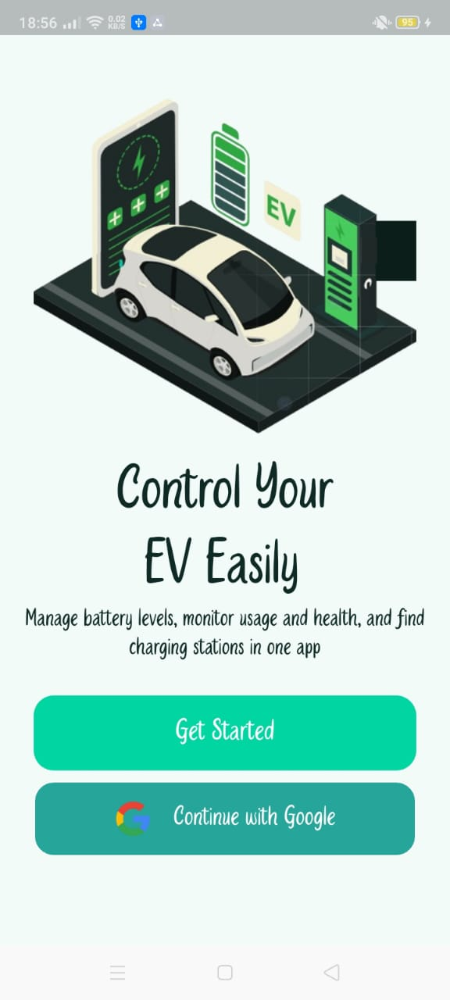 | 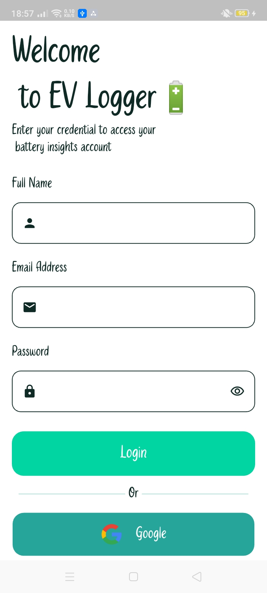 |

### Dashboard
| Home Screen 1 | Home Screen 2 |
|:-------------:|:-------------:|
|  |  |
| 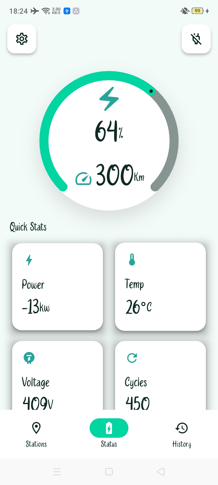 | 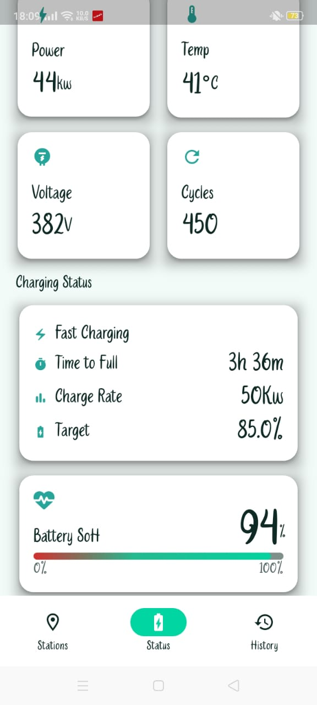 |

### Charging Stations
| Map View | Station Details |
|:--------:|:---------------:|
|  |  |
| 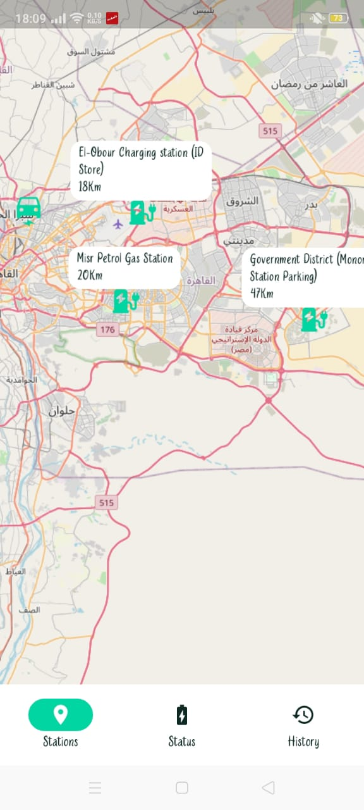 | 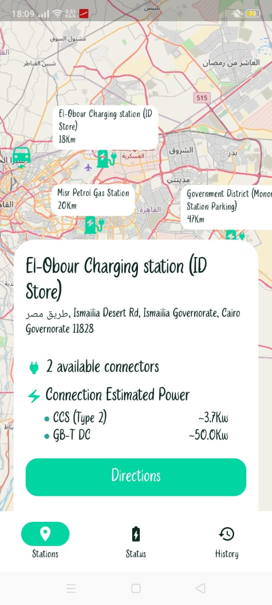 |

### Charging History
| Battery Usage Time | Charging History List |
|:--------:|:---------------:|
| 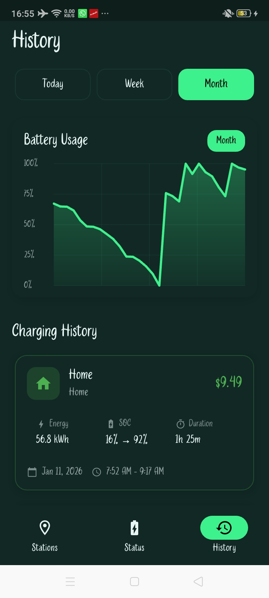 | 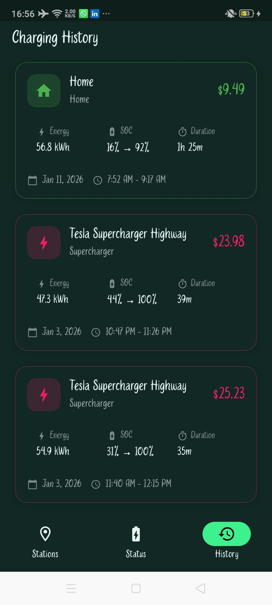 |
| 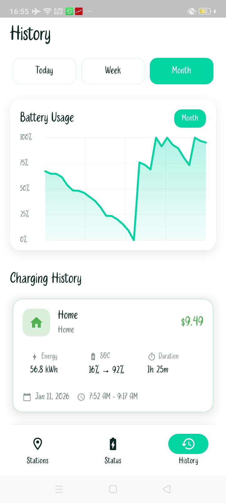 | 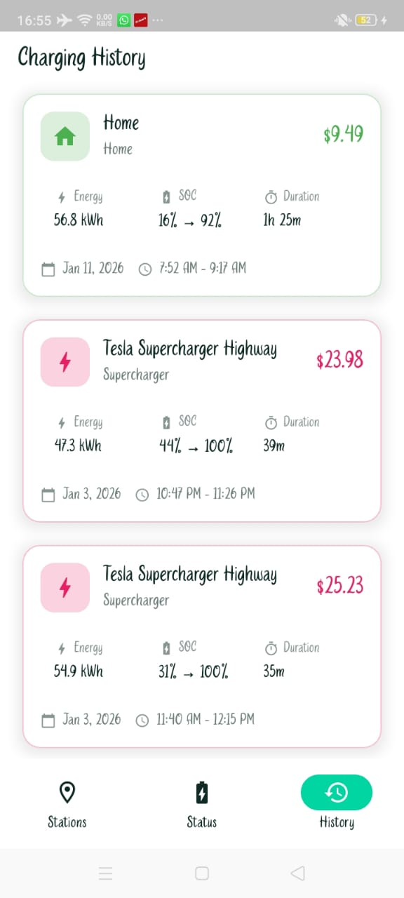 |

### Settings
| Settings | Settings |
|:--------:|:---------------:|
| 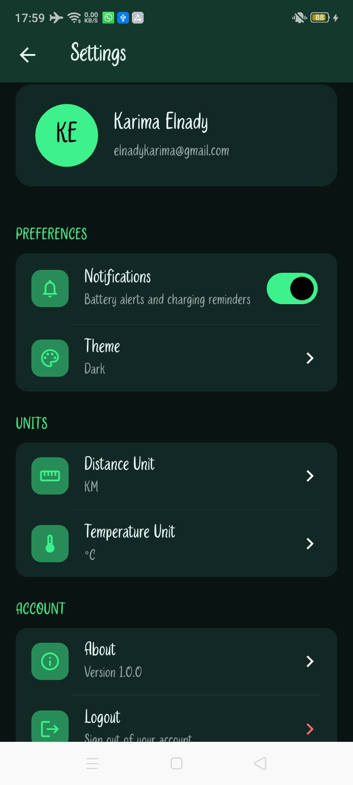 | 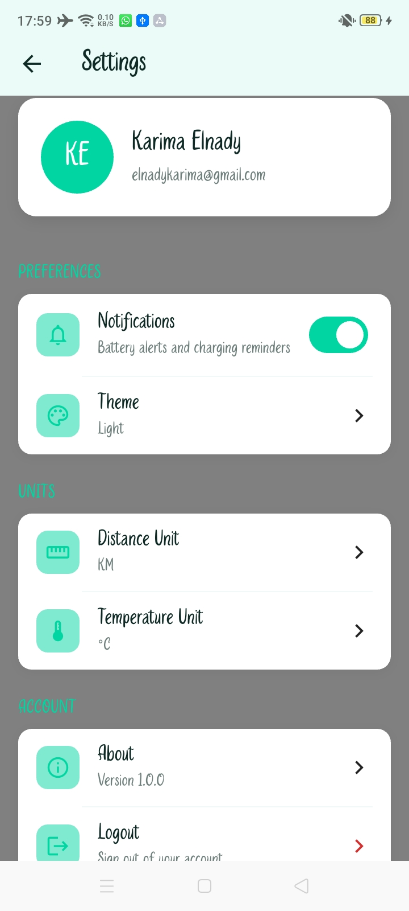 |


---

## 🚧 Development Status & Roadmap

### ✅ Completed
- [x] Firebase Authentication (Email/Password + Google)
- [x] Battery monitoring simulation
- [x] Charging stations API integration
- [x] Interactive map with OpenStreetMap
- [x] Location-based station discovery
- [x] Clean Architecture implementation
- [x] BLoC state management
- [x] Light/Dark theme support
- [x] Enhanced history & analytics screens
- [x] Historical battery data visualization
- [x] Charging session tracking
- [x] User preferences and settings

### 🔄 In Progress
- [ ] UI/UX refinements and animations
- [ ] Firestore integration for data persistence

### 🔮 Planned Features
- [ ] Advanced filtering (by connector type, power output)
- [ ] Sorting options (by distance, availability)
- [ ] Favorite charging stations
- [ ] Route planning to stations
- [ ] Push notifications for charging status
- [ ] iOS platform support
- [ ] Widget tests & integration tests
- [ ] CI/CD pipeline

---

## 🎓 Learning Outcomes & Skills Demonstrated

This project showcases:
- ✅ Clean Architecture implementation in Flutter
- ✅ Advanced state management (BLoC/Cubit)
- ✅ Real-world API integration and error handling
- ✅ Firebase services integration
- ✅ Location-based services
- ✅ Map visualization and geospatial data
- ✅ Functional programming concepts (Either pattern)
- ✅ Modern UI/UX design principles
- ✅ Scalable and maintainable code structure

---

## 🔗 Related Projects

- **[Original Graduation Project (Full IoT System)](https://github.com/Abdelrhman20khaled/Predictive-EV-battery-Charging-for-Prolonged-Battery-Life-Public)** - Complete system with hardware, ML, and mobile components
- **[Meal Planning App](https://github.com/KarimaMahmoud626/Meal-Planning-App)** - Another Clean Architecture project with complex features

---

## 👩‍💻 Author

**Karima Mahmoud Mohammed**  
Junior Flutter Developer | Mobile Engineering Enthusiast

- 📧 Email: karimamahmoud382@gmail.com
- 💼 LinkedIn: [Karima Mahmoud](https://www.linkedin.com/in/karima-mahmoud-885077255)
- 🐙 GitHub: [@KarimaMahmoud626](https://github.com/KarimaMahmoud626)

---

## 📄 License

This project is developed for **educational and portfolio purposes**.

---

## 🙏 Acknowledgments

- [Firebase](https://firebase.google.com/) - Authentication and backend services
- [OpenStreetMap](https://www.openstreetmap.org/) - Map visualization
- [Flutter](https://flutter.dev/) - Mobile framework
- Original graduation project team members

---

**⭐ If you find this project interesting or helpful, please consider giving it a star!**

---

## 💬 Feedback

Found a bug or have suggestions? Feel free to open an issue or reach out via [LinkedIn](https://www.linkedin.com/in/karima-mahmoud-885077255)!
