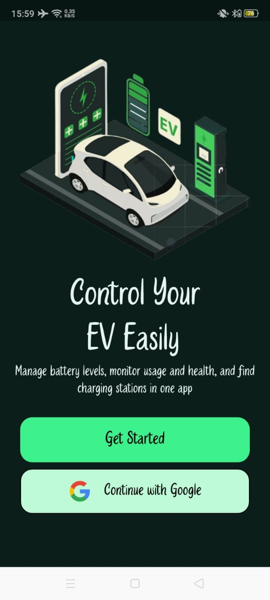
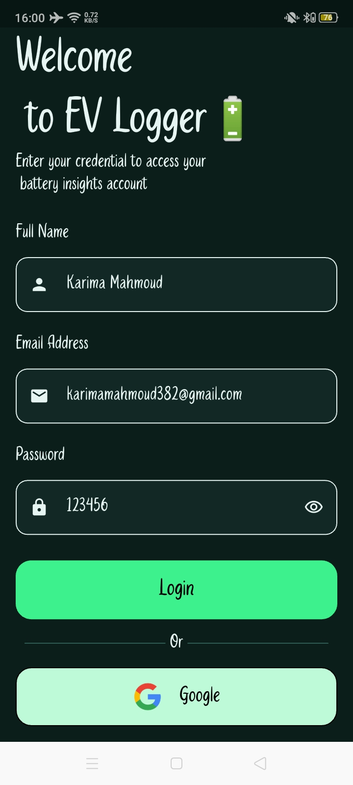
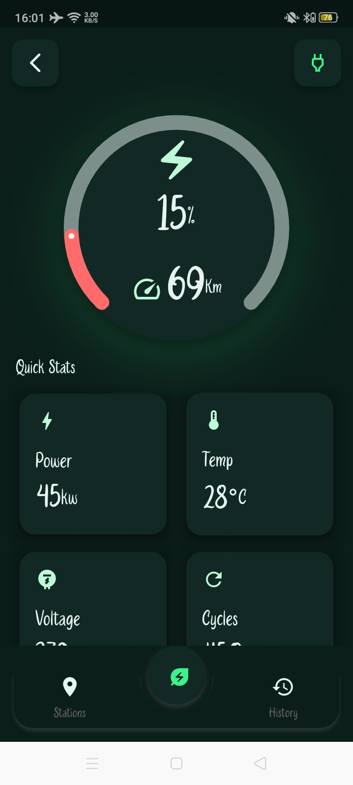
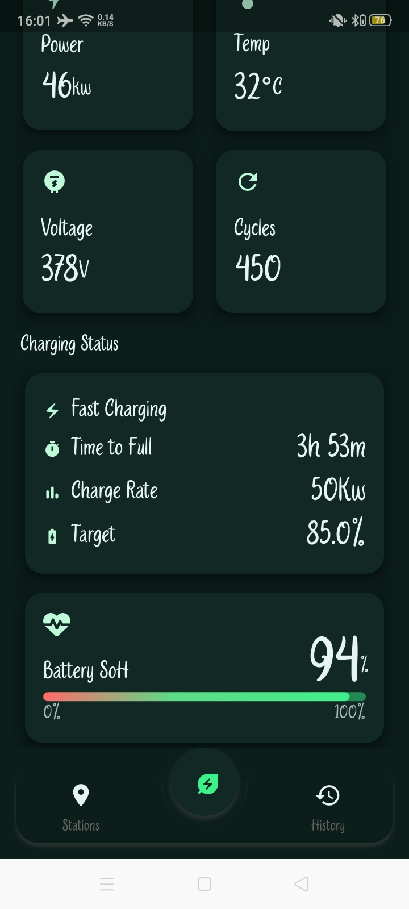
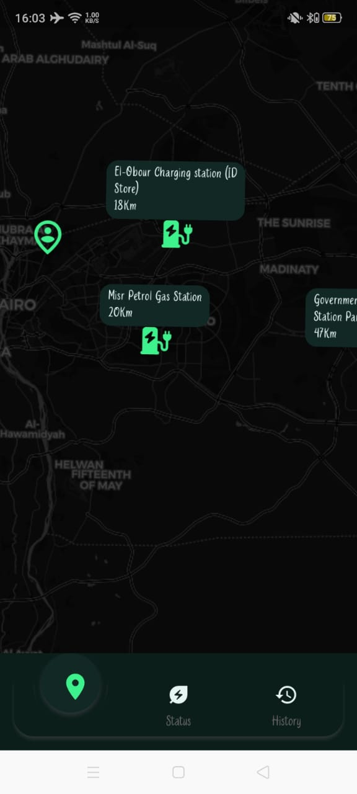
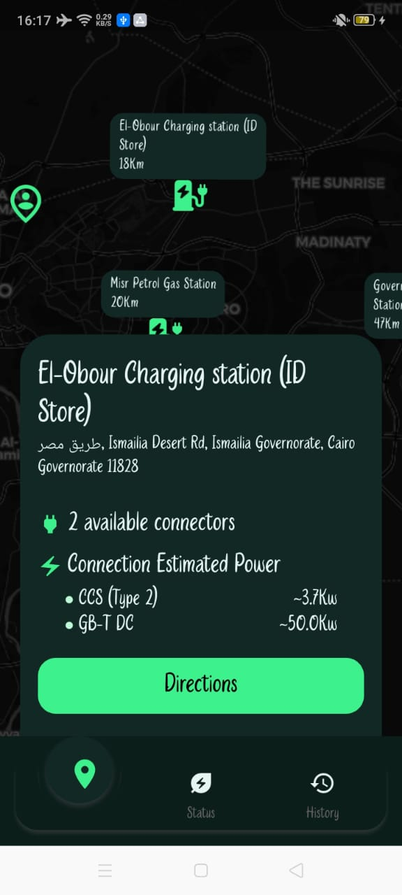

# 🚗 Smart EV Companion App

**Graduation Project (Enhanced Version) — Under Active Development**

A Flutter-based mobile application designed to assist electric vehicle (EV) owners by providing real-time vehicle insights and nearby charging station information, with a strong focus on clean architecture, scalability, and real-world API integration.

---

## 📌 Project Overview

Smart EV Companion App is an enhanced version of a graduation project originally focused on EV battery monitoring.  
This version shifts the focus toward **mobile engineering and system integration**, transforming the app into a practical companion for EV owners.

The application allows users to:
- Monitor simulated EV battery status
- Authenticate securely
- Discover nearby EV charging stations within a 50 km radius
- View detailed charging station information on an interactive map

> ⚠️ **Note:** Machine Learning components from the original graduation project are **not included in the current version**.  
> The current focus is on mobile application architecture and real-world feature development.

---

## 🎯 Problem Statement

EV users often need:
- A quick way to check vehicle-related data remotely
- Reliable access to nearby charging stations
- Clear information about connector types and charging capabilities

This project addresses these needs through a mobile-first solution with a scalable and maintainable architecture.

---

## ✨ Key Features

### 🔐 Authentication
- Firebase Authentication
- Email & Password login
- Google Sign-In

### 🔋 Battery Monitoring (Simulated)
- Battery state simulation (used as a replacement for hardware input)
- Structured data flow ready for future hardware integration

### 📍 Charging Stations Discovery
- Automatic user location detection
- Interactive map using **OpenStreetMap**
- Nearby charging stations within a **50 km radius**
- Charging station details:
  - Active / inactive status
  - Connector types
  - Number of connectors
  - Estimated charging power per connector
- Distance calculation between user and station

### 🗺️ Map Visualization
- Marker-based station visualization
- Color-coded markers based on station status
- Light & Dark theme support

---

## 🧱 Architecture & Design

- **Architecture Pattern:** MVVM + Repository
- **State Management:** BLoC / Cubit
- **Error Handling:** Functional approach using `Either`
- **UI State Handling:** Loading, Empty, Success, Failure states

The project is structured to ensure:
- Clear separation of concerns  
- Testability  
- Ease of future feature expansion  

---

## 🛠️ Tech Stack

- **Flutter (Dart)**
- **BLoC / Cubit**
- **Firebase Authentication**
- **OpenStreetMap**
- **EV Charging Stations API**
- **Location Services**
- **REST API Integration**

---

## 📱 Platform Support

- **Android** (Currently supported)  
- **iOS** (Planned — not configured yet)

---

## 📸 Screenshots

| Onboarding | Authentication |  
|:----------:|:--------------:|
|  |  | 

| Dashboard1 | Dashboard2 | 
|:----------:|:----------:|
|  | |

| Charging Stations Map1 | Charging Stations Map 2 | 
|:----------:|:----------:|
|  | |

---

## 🚧 Project Status

This project is actively under development.

Planned improvements include:
- Enhanced history & analytics screens
- UI/UX refinements
- Additional filtering and sorting for charging stations
- Firestore integration for persistent data storage

---

## 👩‍💻 Author

**Karima Mahmoud**  
Flutter Developer 

- GitHub: https://github.com/KarimaMahmoud626  
- LinkedIn: https://www.linkedin.com/in/karima-mahmoud-885077255

---

## 📄 License

This project is intended for educational and portfolio purposes.
